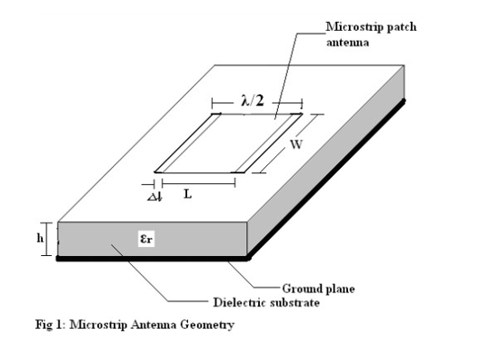
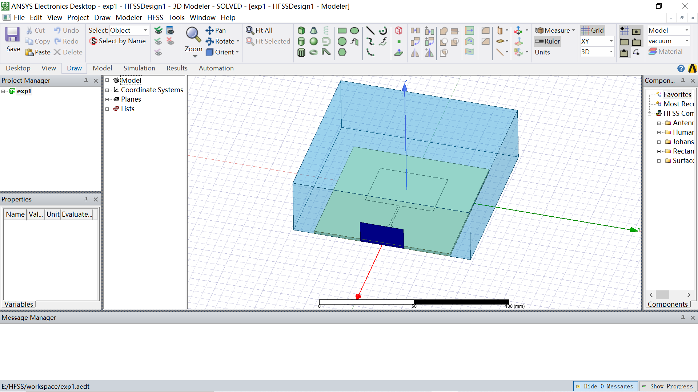
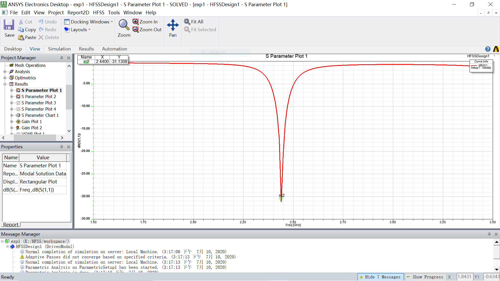
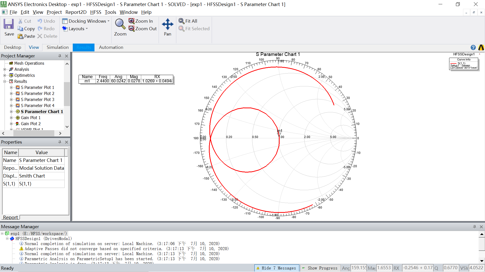
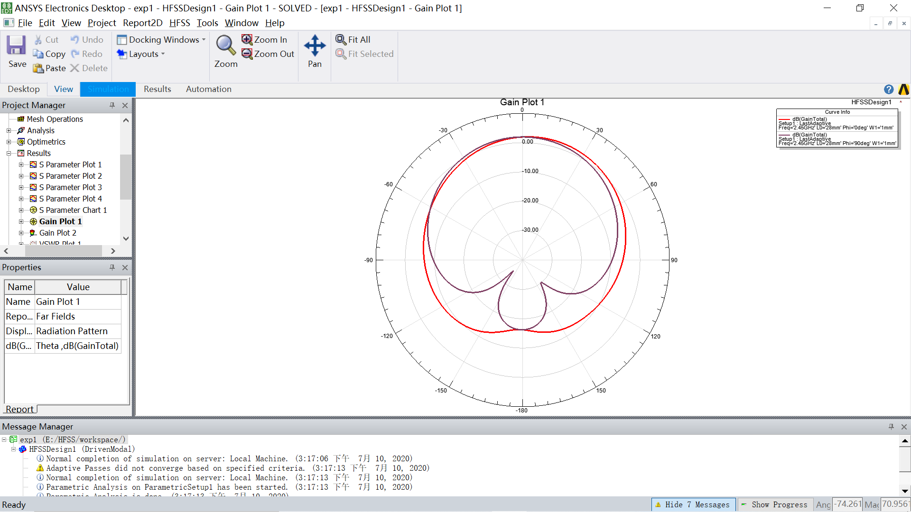
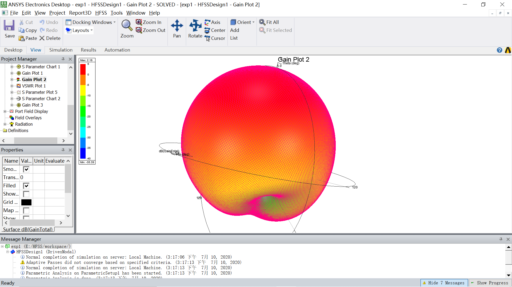
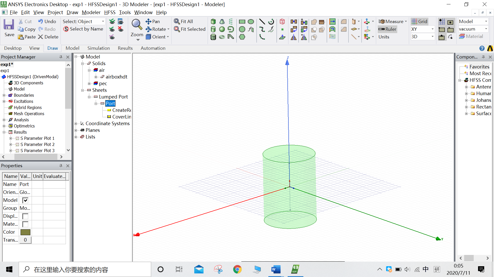
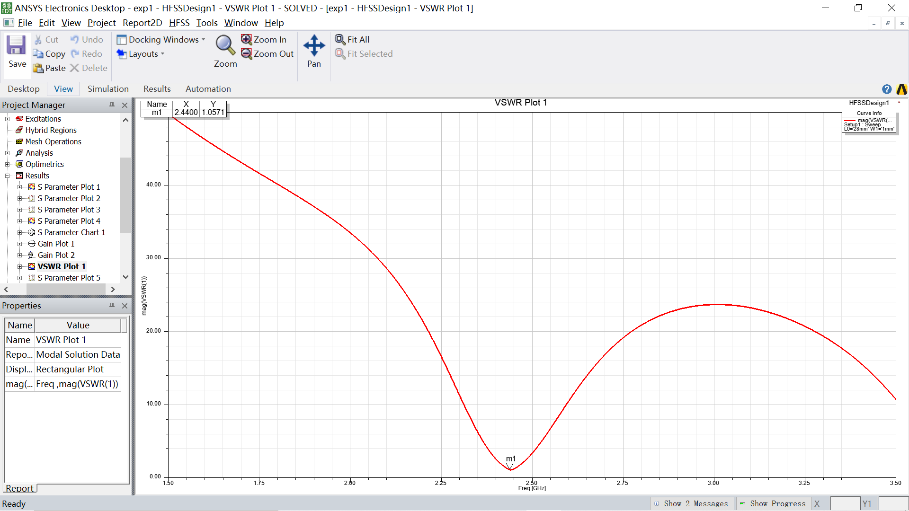
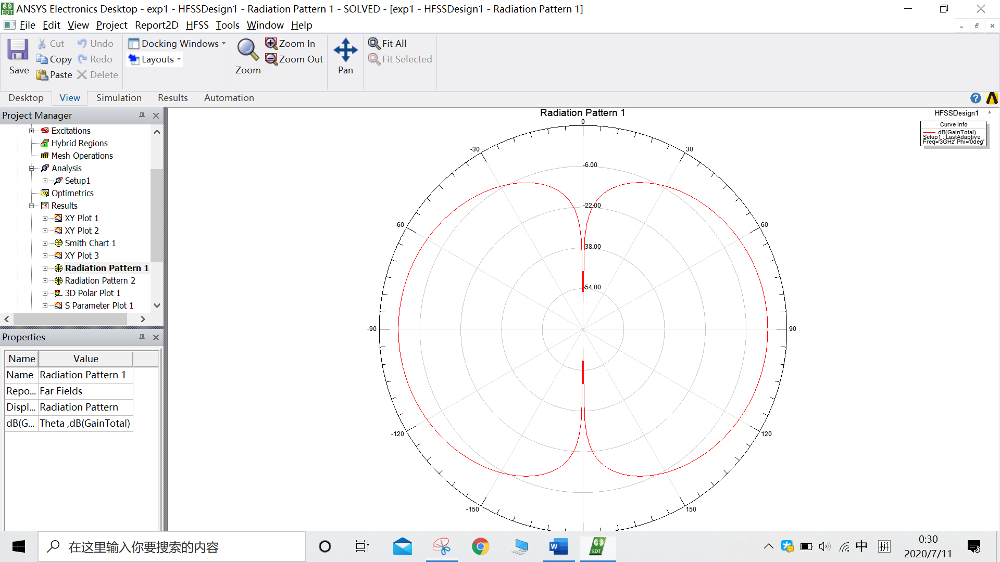
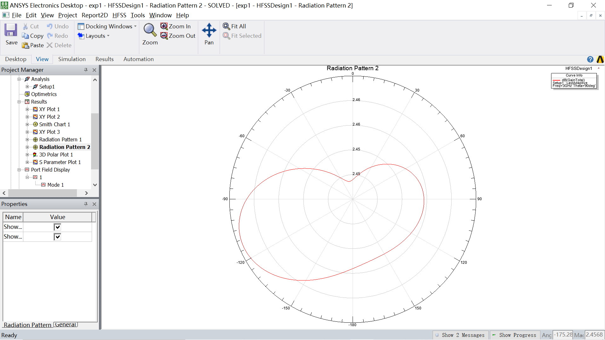

- [1. HFSS_simulation](#1-hfss_simulation)
  - [1.1. 微带天线仿真设计(exp1.aedt)](#11-微带天线仿真设计exp1aedt)
    - [1.1.1. 实验目的](#111-实验目的)
    - [1.1.2. 实验原理](#112-实验原理)
    - [1.1.3. 模型示意图](#113-模型示意图)
    - [1.1.4. 实验结果](#114-实验结果)
    - [1.1.5. 数据分析](#115-数据分析)
  - [1.2. 半波偶极子天线仿真(exp1_1.aedt)](#12-半波偶极子天线仿真exp1_1aedt)
    - [1.2.1. 实验原理](#121-实验原理)
    - [1.2.2. 设计要求](#122-设计要求)
    - [1.2.3. 天线结构示意图](#123-天线结构示意图)
    - [1.2.4. 仿真结果](#124-仿真结果)

# 1. HFSS_simulation
微波技术实验：HFSS仿真设计HFSS

**[The Author's E-mail](http://www.thdong.top/index.php/start-page.html)**

* ANSYS Electromagnetics Suite 19（HFSS）安装：https://www.mr-wu.cn/ansys-electromagnetics-suite-19-free-download/
* HFSS仿真设计参考教程：https://www.bilibili.com/video/BV1kK411W7Fm

## 1.1. 微带天线仿真设计(exp1.aedt)

### 1.1.1. 实验目的

1. 理解和掌握微带天线的设计原理。
2. 选定微带天线的参数：工作频率、介质基片厚度、贴片模型及馈电点位置。
3. 创建工程并根据设计尺寸参数指标绘制微带天线HFSS模型。
4. 保存工程后设定边界条件、求解扫描频率，生成S参数曲线和方向图。
5. 观察对比不同尺寸参数的微带天线的仿真结果，并分析它们对性能的影响。

### 1.1.2. 实验原理

微带线馈电方式又称为侧馈，它用与微带辐射贴片集成在一起的微带传输线进行馈电。它可以中心馈电，也可以偏心馈电，但馈电点的位置取决于激励哪种模式。对于微带传输线的馈电方式，当微带天线的尺寸确定以后，可以先将中心馈电天线辐射贴片同50Ω的馈线一起光刻，测量输入阻抗并设计出阻抗匹配变换器，然后在天线辐射贴片与馈线之间接入该阻抗匹配变换器，从而重新做成天线。
设辐射元的长为L，宽为W，介质基片的厚度为H。将辐射元、介质基片和接地板视为一段长为L的微带传输线，在传输线的两端断开形成开路，根据微带传输线的理论，由于基片厚度	h<<λ，场沿h方向均匀分布。在最简单的情况下，场沿宽度W方向也没有变化，而仅在长度方向（L≈λ/2)有变化。在开路两端的电场均可以分解为相对于接地板的垂直分量和水平分量，两垂直分量方向相反，水平分量方向相同，因而在垂直于接地板的方向，两水平分量电场所产生的远区场同向叠加，而两垂直分量所产生的场反相相消。因此，两开路端的水平分量可以等效为无限大平面上同相激励的两个缝隙，缝的电场方向与长边垂直，并沿长边W均匀分布。缝的宽度△L ≈H，长度为W，两缝间距为L≈ λ/2。这就是说，微带天线的辐射可以等效为有两个缝隙所组成的二元阵列。

### 1.1.3. 模型示意图

### 1.1.4. 实验结果

1. 天线仿真

2. S11史密斯圆

3. 辐射方向增益图

4. 天线三维增益

### 1.1.5. 数据分析

天线仿真，刚开始仿真出来的曲线图最低点频率2.43GHZ，与设定的2.45GHZ相比有偏移，从分析结果中可以看出，天线的谐振频率落在2.45GHz上，而设计要求的中心频率为2.45GHz，S11值约为-23.5bB。此时我们需要更改设计，方法是使用优化选项新增参数，仿真曲线如下图，从图中可看出离2.45GHZ最近的是褐色曲线，尺寸大概26mm。从参数扫描结果看，谐振频率随着L0的增加而降低，当L0=28mm时，谐振频率约为2.45GHz。从参数扫描分析结果看出，改变1/4波长阻抗转换器的宽度W1，不会改变天线的谐振频率。当W1=1.1mm时，2.45GHz频点的S11值最小，约为-23.5dB。由于工作频率与天线长度L有关，可通过更改之前设置的参数数值更改L数值，使仿真结果接近理想值，不断修改贴片形状与馈电位置以使工作频率接近2.45GHZ。通过所作出的实验结果可以看出来，辐射边界表面和辐射体的距离大于1/4个波长，天线的中心频率约等于2.45GHz，扫频范围设置在1.5GHz-3.5GHz，使用快速扫频，在设计中，我调整了微带贴片的长度和阻抗转换器的宽度，以便得到良好的天线性能，并在最后使用了HFSS分析，给出微带天线各项性能参数的分析结果。

## 1.2. 半波偶极子天线仿真(exp1_1.aedt)

### 1.2.1. 实验原理

半波偶极子天线是一种结构简单的基本线天线，也是一种经典的、迄今为止使用最广泛的天线之一。半波偶极子天线由两根直径和长度都相等的直导线组成，每根导线的长度为1/4个工作波长。导线的直径远小于工作波长，在中间的两个端点上由等幅反向的电压激励，中间端点之间的距离远小于工作波长，可以忽略不计。

### 1.2.2. 设计要求

设计一个中心频率为3GHz的半波偶极子天线，天线沿着z轴方向放置，中心位于坐标原点，天线材质使用理想导体，总长度为0.48λ，半径为λ/200。天线馈电采用集总端口激励方式，端口距离为0.24mm，辐射边界和天线的距离为λ/4。

### 1.2.3. 天线结构示意图

### 1.2.4. 仿真结果

1. S参数仿真曲线图

2. 驻波比仿真曲线图

3. 二维、三维方向图
 * XZ面增益图

 * XY面增益方向图

4. 三维增益方向图

